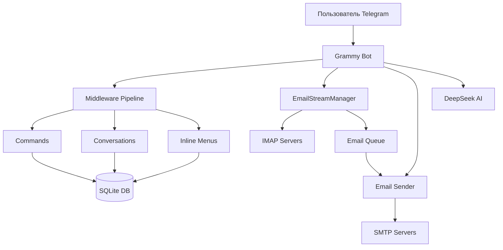
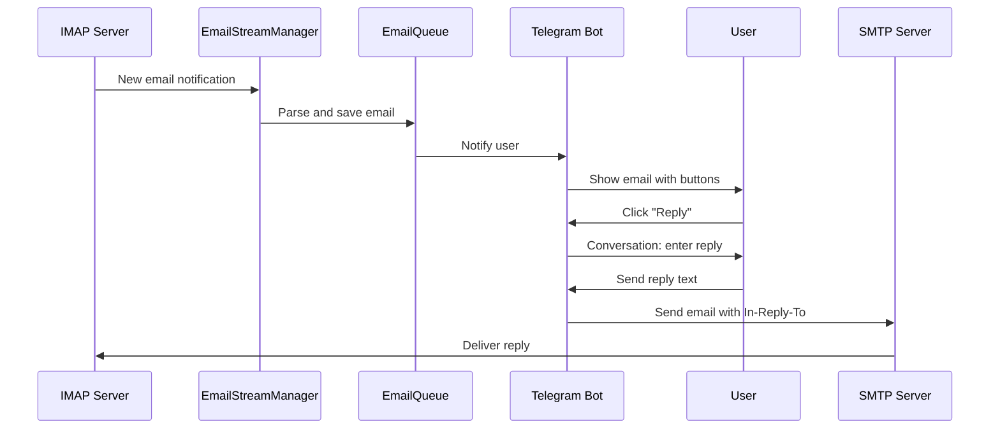

# 📧 Cris Mailer Bot

Профессиональный Telegram бот для автоматизированных email рассылок с мониторингом входящих писем через IMAP и отправкой ответов через SMTP. Включает систему управления пользователями, AI-переводы и гибкую настройку прокси.

## ✨ Основные возможности

### 📨 Email функционал
- **IMAP мониторинг** - автоматическое отслеживание входящих писем в реальном времени
- **SMTP отправка** - массовые рассылки с поддержкой HTML шаблонов
- **Треды писем** - ответы с заголовком In-Reply-To для цепочек переписки
- **Множество аккаунтов** - управление несколькими email аккаунтами одновременно
- **Автореконнект** - автоматическое восстановление соединения при сбоях

### 🤖 Telegram интерфейс
- **Интерактивные меню** - удобные inline клавиатуры для всех функций
- **Conversation flows** - пошаговые диалоги для настройки
- **Админ панель** - полный контроль над пользователями и настройками
- **Система ролей** - guest/user/admin с гибким управлением доступом

### 🧠 AI интеграция
- **DeepSeek API** - перевод входящих писем на русский язык
- **Smart presets** - умные шаблоны с AI обработкой

### 🔧 Дополнительно
- **Прокси поддержка** - HTTP/HTTPS прокси для каждого email аккаунта
- **Приоритеты** - система приоритетов для email адресов
- **Темы и пресеты** - готовые шаблоны для быстрых ответов
- **Спуфинг** - настройка имени отправителя

## 🚀 Установка

### 1. Установите зависимости

```bash
bun install
```

### 2. Настройте конфигурацию

Откройте файл `config.ini` и заполните необходимые параметры:

```ini
# КОНФИГУРАЦИЯ TELEGRAM БОТА
BOT_TOKEN=YOUR_BOT_TOKEN_FROM_BOTFATHER

# ID администраторов (УСТАРЕЛО - используйте систему ролей в БД)
ADMIN_IDS=

# КОНФИГУРАЦИЯ БАЗЫ ДАННЫХ  
DB_FILE_NAME=db.sqlite

# API КЛЮЧИ
DEEPSEEK_API_KEY=YOUR_DEEPSEEK_API_KEY

# Остальные параметры можете оставить как есть или настроить по необходимости
```

**Важно**: Параметр `ADMIN_IDS` оставлен только для обратной совместимости. Рекомендуется использовать новую систему ролей через админ панель.

### 3. Примените миграции базы данных

```bash
bun run drizzle-kit push
```

### 4. Запустите бота

```bash
bun run index.ts
```

### 5. Создайте первого администратора

После того как бот запущен, сначала напишите боту `/start`, затем выполните:

```bash
npx tsx create-admin.ts YOUR_TELEGRAM_ID
```

Где `YOUR_TELEGRAM_ID` - ваш числовой ID в Telegram (можно получить у @userinfobot).

## 📚 Использование

### Команды бота

- `/start` - Запуск бота
- `/admin` - Админ панель (только для администраторов)
- `/config` - Просмотр конфигурации (только для администраторов)
- `/send` - Отправка рассылки
- `/stop` - Остановка рассылки
- `/status` - Статус рассылки

### Система ролей

- **guest** - новый пользователь, нет доступа к функциям бота
- **user** - обычный пользователь, может использовать все функции бота
- **admin** - администратор, имеет доступ к админ панели

### Админ панель

Через админ панель (`/admin`) администраторы могут:

- 👥 **Управление пользователями** - выдавать доступ по Telegram ID
- 📋 **Просмотр доступа** - просматривать список пользователей с доступом
- 👑 Назначать других администраторов
- 🚫 Блокировать доступ пользователей

## 🔧 Конфигурация

Все настройки хранятся в файле `config.ini`:

### Обязательные параметры:
- `BOT_TOKEN` - токен Telegram бота
- `DEEPSEEK_API_KEY` - API ключ для DeepSeek

### Опциональные параметры:
- `DB_FILE_NAME` - имя файла базы данных (по умолчанию: db.sqlite)
- `DEBUG_MODE` - режим отладки (true/false)
- `MAX_RETRY_ATTEMPTS` - максимальное количество попыток отправки
- `DEFAULT_SEND_INTERVAL` - интервал между отправками в секундах
- SMTP настройки для email
- Настройки прокси

## 🏗️ Архитектура

### Основные компоненты



### Поток обработки писем



## 📁 Структура проекта

```
c_old/
├── 📄 index.ts                    # Entry point (запуск бота)
├── 📄 create-admin.ts             # Скрипт создания админа
├── 📄 config.ini                  # Конфигурация (не в git)
├── 📄 drizzle.config.ts           # Конфиг Drizzle ORM
│
├── 📂 drizzle/                    # SQL миграции
│   ├── 0000_nebulous_turbo.sql    # Начальная схема
│   ├── 0001_colorful_scarlet_witch.sql
│   └── 0002_api_keys_table.sql
│
└── 📂 src/
    ├── 📄 bot.ts                  # Инициализация Grammy бота, middleware pipeline
    ├── 📄 config.ts               # Загрузка переменных из config.ini
    ├── 📄 index.ts                # Запуск бота и EmailStreamManager
    ├── 📄 emailStream.ts          # IMAP мониторинг (ImapFlow)
    ├── 📄 emailQueue.ts           # Очередь входящих писем
    ├── 📄 emailSender.ts          # SMTP отправка (Nodemailer)
    │
    ├── 📂 commands/               # Slash команды бота
    │   ├── start.ts               # /start - приветствие
    │   ├── admin.ts               # /admin - админ панель
    │   ├── send.ts                # /send - запуск рассылки
    │   ├── stop.ts                # /stop - остановка рассылки
    │   ├── status.ts              # /status - статус рассылки
    │   └── config.ts              # /config - просмотр конфигурации
    │
    ├── 📂 conversations/          # Диалоги (@grammyjs/conversations)
    │   ├── emailAdd.ts            # Добавление email аккаунтов
    │   ├── emailEdit.ts           # Редактирование email
    │   ├── sendEmail.ts           # Отправка письма через conversation
    │   ├── topicAdd.ts            # Добавление тем
    │   ├── topicEdit.ts           # Редактирование тем
    │   ├── presetAdd.ts           # Добавление пресетов
    │   ├── presetEdit.ts          # Редактирование пресетов
    │   ├── smartPresetAdd.ts      # Smart пресеты с AI
    │   ├── smartPresetEdit.ts
    │   ├── proxyAdd.ts            # Добавление прокси
    │   ├── proxyEdit.ts           # Редактирование прокси
    │   ├── nickCheck.ts           # Проверка никнеймов
    │   ├── priorityEdit.ts        # Редактирование приоритетов
    │   ├── intervalEdit.ts        # Редактирование интервалов
    │   ├── spoofNameEdit.ts       # Редактирование имени отправителя
    │   ├── apiKeyEdit.ts          # Редактирование API ключей
    │   ├── profileIdEdit.ts       # Редактирование Profile ID
    │   ├── htmlTemplateGet.ts     # Получение HTML шаблонов
    │   └── userManagement.ts      # Управление пользователями
    │
    ├── 📂 menus/                  # Inline клавиатуры (@grammyjs/menu)
    │   └── settings/              # Меню настроек
    │       ├── emails.ts          # Управление email аккаунтами
    │       ├── topics.ts          # Управление темами
    │       ├── presets.ts         # Управление пресетами
    │       ├── smartPresets.ts    # Smart пресеты
    │       ├── proxies.ts         # Управление прокси
    │       ├── priority.ts        # Настройка приоритетов
    │       ├── interval.ts        # Настройка интервалов
    │       ├── spoof.ts           # Настройка спуфинга
    │       ├── apiKey.ts          # Управление API ключами
    │       ├── profileId.ts       # Настройка Profile ID
    │       └── team.ts            # Управление командой
    │
    ├── 📂 handlers/               # Обработчики callback_query
    │   ├── adminPanel.ts          # Админ панель handlers
    │   ├── adminCallbacks.ts      # Callback админ функций
    │   ├── settings.ts            # Обработка настроек
    │   ├── sendEmail.ts           # Отправка email через handler
    │   ├── htmlTemplates.ts       # Работа с HTML шаблонами
    │   ├── nickCheck.ts           # Проверка никнеймов
    │   └── fastAdd.ts             # Быстрое добавление
    │
    ├── 📂 callbacks/              # Специальные callbacks
    │   └── getMail.ts             # Обработка входящих писем (перевод, ответ)
    │
    ├── 📂 middlewares/            # Middleware слой
    │   ├── userMiddleware.ts      # Проверка ролей, создание юзера
    │   ├── roleMiddleware.ts      # Проверка прав доступа
    │   └── ReplyOrEdit.ts         # Хелпер для reply/edit сообщений
    │
    ├── 📂 db/                     # База данных
    │   ├── index.ts               # Инициализация Drizzle ORM
    │   ├── schema.ts              # Схема БД (таблицы)
    │   └── queries/               # Репозитории для работы с БД
    │       ├── user.ts            # UserRepo - пользователи
    │       ├── email.ts           # EmailRepo - email аккаунты
    │       ├── emailMessage.ts    # EmailMsgRepo - входящие письма
    │       ├── topic.ts           # TopicRepo - темы
    │       ├── preset.ts          # PresetRepo - пресеты
    │       ├── smartPreset.ts     # SmartPresetRepo
    │       ├── proxy.ts           # ProxyRepo - прокси
    │       ├── keys.ts            # KeysRepo - API ключи
    │       └── adverts.ts         # AdvertsRepo - объявления
    │
    ├── 📂 utils/                  # Утилиты
    │   ├── sendEmail.ts           # Функция отправки email
    │   ├── openAI.ts              # Интеграция с DeepSeek
    │   ├── smartPresets.ts        # Логика smart пресетов
    │   ├── priority.ts            # Логика приоритетов
    │   ├── nickify.ts             # Генерация никнеймов
    │   ├── proxyForm.ts           # Форматирование прокси
    │   ├── checkProxyHttp.ts      # Проверка HTTP прокси
    │   ├── createAdmin.ts         # Создание админа
    │   └── conversationTimeout.ts # Таймауты для conversations
    │
    ├── 📂 views/                  # Генерация текста для отображения
    │   └── settings.ts            # Тексты настроек
    │
    ├── 📂 templates/              # HTML шаблоны для писем
    │   ├── back.html              # Шаблон "back"
    │   ├── go.html                # Шаблон "go"
    │   ├── push.html              # Шаблон "push"
    │   └── sms.html               # Шаблон "sms"
    │
    └── 📂 types/                  # TypeScript типы
        └── index.ts               # CustomContext, SessionData и др.
```

## 🔧 Технологический стек

### Runtime & Language
- **Bun** `^1.3.4` - JavaScript runtime (быстрее Node.js)
- **TypeScript** `^5` - строгая типизация

### Bot Framework
- **grammy** `^1.38.3` - современный Telegram bot framework
- **@grammyjs/conversations** - диалоги с состоянием
- **@grammyjs/menu** - inline клавиатуры
- **@grammyjs/runner** - long polling runner
- **@grammyjs/auto-retry** - автоматические повторы API запросов
- **@grammyjs/hydrate** - hydration context
- **@grammyjs/files** - работа с файлами
- **@grammyjs/commands** - обработка команд
- **@grammyjs/ratelimiter** - rate limiting

### Email
- **imapflow** `^1.0.198` - современный IMAP клиент
- **nodemailer** `^7.0.9` - SMTP отправка
- **mailparser** `^3.7.4` - парсинг email сообщений

### Database
- **better-sqlite3** `^12.4.1` - SQLite драйвер
- **drizzle-orm** `^0.44.6` - Type-safe ORM
- **drizzle-kit** `^0.31.5` - миграции и схема

### AI & Utils
- **openai** `^6.2.0` - SDK для DeepSeek API
- **axios** `^1.12.2` - HTTP клиент
- **dotenv** `^17.2.3` - переменные окружения

## 🔄 Как работает система

### 1. Мониторинг входящих писем (IMAP)

```typescript
// src/emailStream.ts
class EmailStreamManager {
  // Для каждого email аккаунта создается IMAP соединение
  static async startStream(telegramId, emailId, credentials) {
    // 1. Подключение к IMAP серверу
    await client.connect()
    await client.mailboxOpen("INBOX")
    
    // 2. Инициальный скан (последние N писем)
    await this.scan(...)
    
    // 3. Live мониторинг через IDLE
    client.on("exists", () => {
      // Новое письмо → скан → сохранение в БД → уведомление в Telegram
    })
    
    // 4. Автореконнект при обрыве
    client.on("close", () => scheduleReconnect())
  }
}
```

### 2. Отправка писем (SMTP)

```typescript
// src/emailSender.ts
// Используется Nodemailer с заголовком In-Reply-To для ответов
await transporter.sendMail({
  from: `"${spoofName}" <${email}>`,
  to: recipientEmail,
  subject: replySubject,
  html: htmlContent,
  headers: {
    'In-Reply-To': originalMessageId,  // Создание треда
    'References': originalMessageId
  }
})
```

### 3. Middleware Pipeline

```typescript
// src/bot.ts
bot.use(timeout(30s))          // Таймаут для всех операций
bot.use(session())             // Сессии для conversations
bot.use(sequentialize())       // Последовательная обработка per-user
bot.use(conversations())       // Плагин для диалогов
bot.use(userMiddleware)        // Проверка ролей guest/user/admin
bot.use(commands)              // /start, /send, /admin и др.
bot.use(conversations)         // Диалоги (emailAdd, topicEdit и т.д.)
bot.use(menus)                 // Inline меню (emails, topics и т.д.)
bot.use(callbacks)             // Callback handlers
bot.use(handlers)              // Дополнительные handlers
```

### 4. Роли и доступ

```typescript
// src/middlewares/userMiddleware.ts
// При каждом update проверяется роль пользователя
const userRole = await UserRepo.getRole(telegramId)

if (userRole === "guest") {
  // Блокируем доступ ко всем функциям кроме /start
  return ctx.reply("🚫 Нет доступа. Обратитесь к админу")
}

// user и admin получают полный доступ
await next()
```

## 🛠️ Разработка

### Полезные команды

```bash
# Запуск бота
bun run index.ts

# Разработка с автоперезапуском
bun --watch run index.ts

# Применить миграции БД
bun run drizzle-kit push

# Создать миграцию
bun run drizzle-kit generate

# Просмотр БД в браузере
bun run drizzle-kit studio

# Проверка типов TypeScript
bun tsc --noEmit
```

### Отладка

Логирование включено для всех критических операций:
- `🔍` - входящие callback_query
- `✅` - успешные операции
- `❌` - ошибки
- `📊` - статистика
- `🔌` - IMAP подключения
- `📧` - email операции

## 📝 Лицензия

Частный проект.

## 🤝 Вклад

Проект находится в активной разработке. Pull requests приветствуются!

---

**Разработано на** [Bun](https://bun.sh) runtime 🚀
